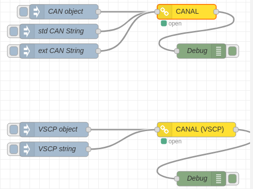

# node-red-contrib-canal


This is a node that interface a CANAL driver.

__Tested with node v11.8.0 and below__



This node is a CANAL interface for node-red. CANAL stands for [CAN Abstraction Layer](https://docs.vscp.org/#canal) and is the least common denominator for low level drivers for the [Very Simple Control Protocol, VSCP](https://www.vscp.org). In the VSCP world CANAL driver is also called level I drivers. 

The CANAL interface is documented [here](https://docs.vscp.org/#canal)

There are plenty of CANAL drivers available. Some of them are documented [here](https://docs.vscp.org/vscpd/13.1/#/level_i_drivers)

You always send and receive CAN messages through a CANAL interface. This is just the abstraction and for example VSCP pack VSCP events into CAN packages for some types of events. You can actually pack anything you like and anything the driver expect. The format is CAN but the meaning for each packet is up to you or at least the CANAL driver maker.

## Install

Install with

```bash
npm install node-contrib-vscp-canal
```

or install from the node-red user interface.

## Usage

The CANAL node have one input that is used to send CAN messages to the CANAL driver and one output that receive CAN messages from the driver.

You have the option to automatically translate VSCP events to/from the node by selecting **Use VSCP translation** in the configuration. This is convenient if you work with VSCP hardware, but you have always the option to use **node-red-contrib-vscp** as an alternative as it contains nods that does the translation to.

The configuration let you define CANAL drivers on a system level and then select which driver to use for the moment. This is often convenient and time saving when you work with different CANAL drivers.

You configure a CANAL driver by giving it a descriptive **name**. The you set the **path** to the actual driver. The **configuration string** is specific for each driver so you have to read the documentation for the driver you want to use to understand required parameters. This is also true for the **flags** value, but with the difference that tha flags value is numeric instead of a semicolon separated string.

When you have setup one or more drivers select it for the CANAL node and deploy. The status of the node will tell you if the interface is opened OK or not. If all is OK you can start to use the node.

Select the **Use VSCP translation** if you want to work with VSCP events instead of CAN messages.

### Sending CAN messages

You can send CAN messages either as JSON objects or strings.

#### JSON objects

To send a CAN message on JSON object form you send something like this

```javascript
{
    "ext":false,
    "rtr":false,
    "canid":123,
    "dlc":5,
    "data":[1,2,3,4,5]}
}
```

You can omit **dlc** which is data count, **ext** which marks an extended CAN message (default is *false*) and **rtr** which is remote transfer request (default is *false*).

Leave data as an empty array if the CAN message has no data.

#### String

IUf you prefer you can send CAN messages on string form. The format is

```
<canid>#{R|data}
```
All data should be hexadecimal. 

**canid** - A standard id is three hexadecimal characters, an extended id is eight hexadecimal characters. The canid for the CAN message must be less than 0x7ff for a standard CAN message. 

**data** is a hex number for each data byte. Empty if no data.

**R** is a remote transmission request and in this case there  should be no data.

Examples of format

```
123#DEADBEEF - standard frame 
5AA#         - Standard frame no data
1F334455#1122334455667788 - extended frame
123#R         - for remote transmission request.
```

### Sending VSCP events

Select the **Use VSCP translation** if you want to work with VSCP events instead of CAN messages. Now you can send VSCP events directly. You can send VSCP events as JSON objects or as strings.

#### JSON object

A typical VSCP event looks like.

```javascript
{   "vscpHead":0,
   "vscpObId":0,
   "vscpClass":10,
   "vscpType":6,
   "vscpGuid":"ff:ee:dd:cc:bb:aa:99:88:77:66:55:44:33:22:11:00",
   "vscpTimeStamp":1234567,
   "vscpDateTime":"2018-03-03T12:01:40Z",
   "vscpData":[1,2,3,4],
}
```

Parameter you omit will often get meaningful defaults.

#### String

The string form for the VSCP event looks like this

```javascript
head,class,type,obid,datetime,timestamp,GUID,data0,data1,data2,...........
```

and in real numbers

```javascript
0,20,3,,,0,-,15,14,13,12,11,10,9,8,7,6,5,4,3,2,0,0,1,35
```

### Receiving CAN messages

When the node is connected to the driver CAN messages will be received on JSON object form.

A typical received CAN message looks like this

```javascript
{
    id: 546
    flags: 0
    obid: 0
    timestamp: 0
    data: array[3,17,34,51]
}
```
**flags** will have bit one set for an extended id message and bit two set for a remote transmission message.

### Receiving VSCP events

Select the **Use VSCP translation** if you want to work with VSCP events instead of CAN messages. Now you will receive VSCP events directly. Received VSCP events are always on JSON object form.

A typical VSCP event looks like.

```javascript
{   "vscpHead":0,
   "vscpObId":0,
   "vscpClass":10,
   "vscpType":6,
   "vscpGuid":"ff:ee:dd:cc:bb:aa:99:88:77:66:55:44:33:22:11:00",
   "vscpTimeStamp":1234567,
   "vscpDateTime":"2018-03-03T12:01:40Z",
   "vscpData":[1,2,3,4],
}
```

## Constants

If you want to use CANAL constants you can add [node-canal](https://www.npmjs.com/package/node-canal) to node-red. 

First go to your **.node-red** folder and install node-canal with

```bash
npm install node-canal
```

then add node-canal to the node-red *settings.js* file(also in the .node-red folder).

```javascript
functionGlobalContext: {
    CANAL:require('node-canal')
}
```

Now restart node-red with

```bash
systemctl restart nodered
```

You can now use all constants defined in node-canal. See the [node-canal documentation](https://www.npmjs.com/package/node-canal) for more info.

For work with VSCP the constants for events (VSCL classes and types) may be useful. See the documentation for [node-red-contrib-vscp](https://www.npmjs.com/package/node-red-contrib-vscp) for a guide on how to do this. 

## Samples

Here is a simple sample flow that use the [vscpl1drv_socketcan](https://github.com/grodansparadis/vscpl1drv-socketcan)

```javascript
[{"id":"ee3919bd.6af248","type":"canal","z":"295a49d7.d930e6","name":"CANAL","driver":"d5d84513.4b7e8","bvscp":false,"x":380,"y":120,"wires":[["fdbf3cc8.2b73"]]},{"id":"974a318d.1e024","type":"inject","z":"295a49d7.d930e6","name":"CAN object","topic":"","payload":"{\"id\":123,\"flags\":1,\"obid\":33,\"timestamp\":0,\"data\":[11,22,33,44,55,66,77,88]}","payloadType":"json","repeat":"","crontab":"","once":false,"onceDelay":0.1,"x":130,"y":120,"wires":[["ee3919bd.6af248"]]},{"id":"fdbf3cc8.2b73","type":"debug","z":"295a49d7.d930e6","name":"Debug","active":true,"tosidebar":true,"console":false,"tostatus":false,"complete":"payload","targetType":"msg","x":410,"y":200,"wires":[]},{"id":"5127a4e3.0d6bcc","type":"inject","z":"295a49d7.d930e6","name":"std CAN String","topic":"","payload":"123#11223344","payloadType":"str","repeat":"","crontab":"","once":false,"onceDelay":0.1,"x":120,"y":160,"wires":[["ee3919bd.6af248"]]},{"id":"644daf4a.0ff268","type":"inject","z":"295a49d7.d930e6","name":"ext CAN String","topic":"","payload":"120A0600#11","payloadType":"str","repeat":"","crontab":"","once":false,"onceDelay":0.1,"x":120,"y":200,"wires":[["ee3919bd.6af248"]]},{"id":"43fa6ff1.5a451","type":"inject","z":"295a49d7.d930e6","name":"VSCP object","topic":"","payload":"{\"vscpHead\":80,\"vscpClass\":10,\"vscpType\":6,\"vscpGuid\":\"00:00:00:00:00:00:00:00:00:00:00:00:00:00:00:2a\",\"vscpObid\":0,\"vscpData\":[11,22,33,44,55],\"vscpTimeStamp\":34565634,\"vscpDateTime\":\"2020-02-24T11:10:59.807Z\"}","payloadType":"json","repeat":"","crontab":"","once":false,"onceDelay":0.1,"x":110,"y":360,"wires":[["4b35168.93e0d68"]]},{"id":"da3c6507.9aefa","type":"inject","z":"295a49d7.d930e6","name":"VSCP string","topic":"","payload":"0,20,3,,,,0:1:2:3:4:5:6:7:8:9:10:11:12:13:14:15,0,1,35","payloadType":"str","repeat":"","crontab":"","once":false,"onceDelay":0.1,"x":110,"y":400,"wires":[["4b35168.93e0d68"]]},{"id":"4b35168.93e0d68","type":"canal","z":"295a49d7.d930e6","name":"CANAL (VSCP)","driver":"d5d84513.4b7e8","bvscp":true,"x":400,"y":360,"wires":[["8a1901de.826508"]]},{"id":"8a1901de.826508","type":"debug","z":"295a49d7.d930e6","name":"Debug","active":true,"tosidebar":true,"console":false,"tostatus":false,"complete":"payload","targetType":"msg","x":410,"y":460,"wires":[]},{"id":"d5d84513.4b7e8","type":"canaldrv-config","z":"","name":"socketcan - vcan0","path":"/home/akhe/development/VSCP/vscpl1drv-socketcan/linux/vscpl1drv-socketcan.so.1.1.0","config":"vcan0","flags":"0"}]
```

In the exampel flow we use the [Socketcan CANAL driver](https://docs.vscp.org/vscpd/13.1/#/level1_driver_socketcan) to illustrated examples. This driver is chosen because it is easy to use on a system without any extra hardware which means everyone can take it for a test. candump/cansend from the [can-utils](https://github.com/linux-can/can-utils) package is useful tools. Install can-utils with 

```bash
sudo apt update
sudo apt install can-utils
```

To [set up a test CAN interface](https://en.wikipedia.org/wiki/SocketCAN)(_vcan0_) use

```bash
modprobe can
modprobe can_raw
modprobe vcan
sudo ip link add dev vcan0 type vcan
sudo ip link set up vcan0
ip link show vcan0
```

You have a couple of samples [here](https://github.com/grodansparadis/node-canal/tree/master/samples).

---

## VSCP & friends
The VSCP subsystem consist of many system components. 

### VSCP Daemon
The VSCP daemon is a central piece of software that act as a hub for VSCP based hardware or hardware that abstract as VSCP hardware, You can find the documentation for the VSCP daemon [here](https://docs.vscp.org/#vscpd).

### VSCP Works
VSCP works is a tool that make sinteraction with VSCP system components easy. VSCP Works is documented [here](https://docs.vscp.org/#vscpworks).

### VSCP Helper library
The VSCP helper library is a c/c++ library with common VSCP functionality. It is available for Python to and will be available for PHP and node.js. It is documented [here](https://docs.vscp.org/#vscphelper);  

### More
There is plenty of other tools available in the VSCP subsystem. Check the docs and the downloads.

### Other VSCP node-red nodes

There are other node-red parts in development or already available that makes it possible to easily connect to websocket interfaces on remote VSCP daemons/servers or hosts.

Checkout [node-red-contrib-vscp-tcp](https://www.npmjs.com/package/node-red-contrib-vscp-tcp) that contains nodes that connect to a remote VSCP tcp/ip host interface and send/receive events.

If you work with CAN, and especially CAN4VSCP, you might find [node-red-contrib-socketcan](https://www.npmjs.com/package/node-red-contrib-socketcan) and  [node-red-contrib-canal](https://www.npmjs.com/package/node-red-contrib-canal) useful.

---
Copyright © 2020 Ake Hedman, Grodans Paradis AB - MIT License